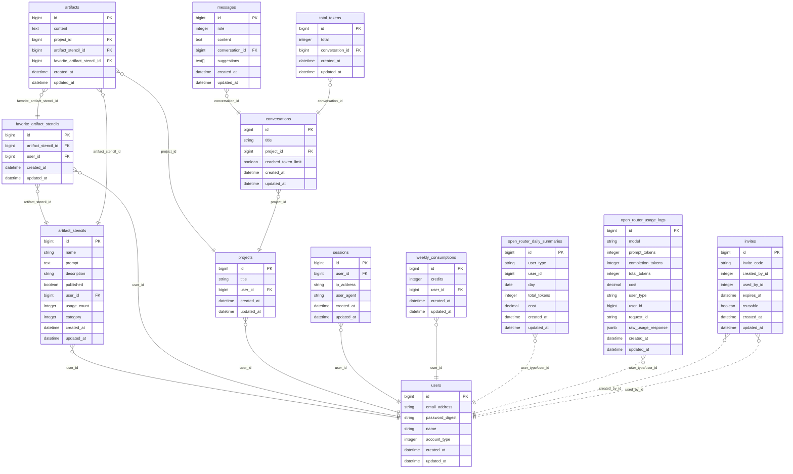

```mermaid
erDiagram
    users {
        bigint id PK
        string email_address
        string password_digest
        string name
        integer account_type
        datetime created_at
        datetime updated_at
    }

    artifact_stencils {
        bigint id PK
        string name
        text prompt
        string description
        boolean published
        bigint user_id FK
        integer usage_count
        integer category
        datetime created_at
        datetime updated_at
    }

    favorite_artifact_stencils {
        bigint id PK
        bigint artifact_stencil_id FK
        bigint user_id FK
        datetime created_at
        datetime updated_at
    }

    artifacts {
        bigint id PK
        text content
        bigint project_id FK
        bigint artifact_stencil_id FK
        bigint favorite_artifact_stencil_id FK
        datetime created_at
        datetime updated_at
    }

    projects {
        bigint id PK
        string title
        bigint user_id FK
        datetime created_at
        datetime updated_at
    }

    conversations {
        bigint id PK
        string title
        bigint project_id FK
        boolean reached_token_limit
        datetime created_at
        datetime updated_at
    }

    messages {
        bigint id PK
        integer role
        text content
        bigint conversation_id FK
        text[] suggestions
        datetime created_at
        datetime updated_at
    }

    total_tokens {
        bigint id PK
        integer total
        bigint conversation_id FK
        datetime created_at
        datetime updated_at
    }

    sessions {
        bigint id PK
        bigint user_id FK
        string ip_address
        string user_agent
        datetime created_at
        datetime updated_at
    }

    weekly_consumptions {
        bigint id PK
        integer credits
        bigint user_id FK
        datetime created_at
        datetime updated_at
    }

    invites {
        bigint id PK
        string invite_code
        integer created_by_id
        integer used_by_id
        datetime expires_at
        boolean reusable
        datetime created_at
        datetime updated_at
    }

    open_router_daily_summaries {
        bigint id PK
        string user_type
        bigint user_id
        date day
        integer total_tokens
        decimal cost
        datetime created_at
        datetime updated_at
    }

    open_router_usage_logs {
        bigint id PK
        string model
        integer prompt_tokens
        integer completion_tokens
        integer total_tokens
        decimal cost
        string user_type
        bigint user_id
        string request_id
        jsonb raw_usage_response
        datetime created_at
        datetime updated_at
    }

    %% Relationships
    artifact_stencils }o--|| users : "user_id"
    favorite_artifact_stencils }o--|| users : "user_id"
    favorite_artifact_stencils }o--|| artifact_stencils : "artifact_stencil_id"
    artifacts }o--|| projects : "project_id"
    artifacts }o--|| artifact_stencils : "artifact_stencil_id"
    artifacts }o--|| favorite_artifact_stencils : "favorite_artifact_stencil_id"
    projects }o--|| users : "user_id"
    conversations }o--|| projects : "project_id"
    messages }o--|| conversations : "conversation_id"
    total_tokens }o--|| conversations : "conversation_id"
    sessions }o--|| users : "user_id"
    weekly_consumptions }o--|| users : "user_id"

    %% Polymorphic associations (dashed)
    open_router_daily_summaries }o..|| users : "user_type/user_id"
    open_router_usage_logs }o..|| users : "user_type/user_id"
    invites }o..|| users : "created_by_id"
    invites }o..|| users : "used_by_id"
```